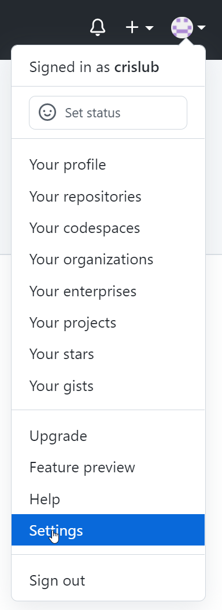
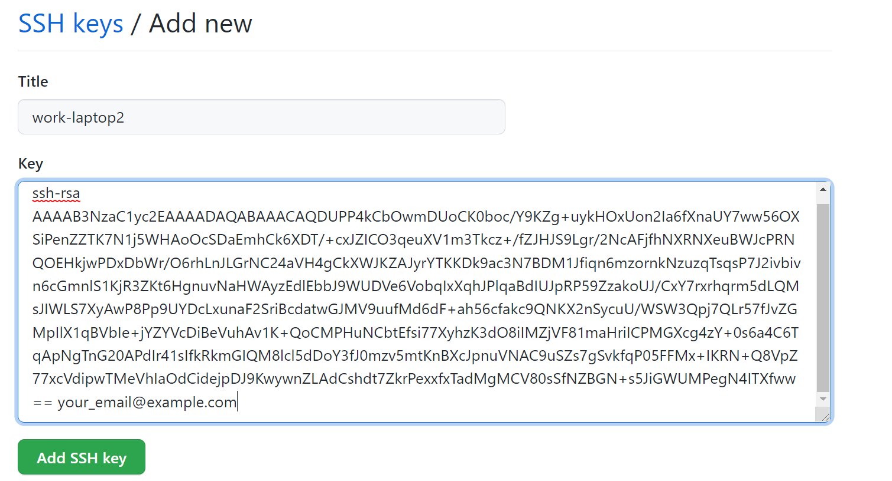
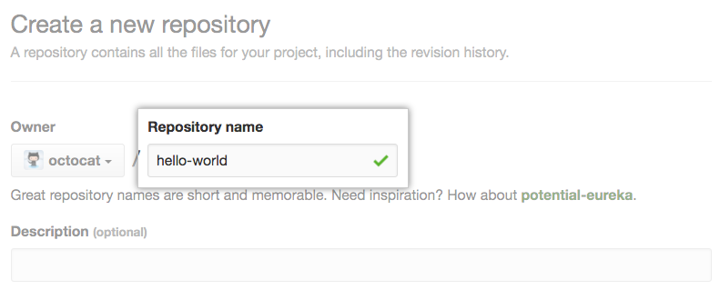
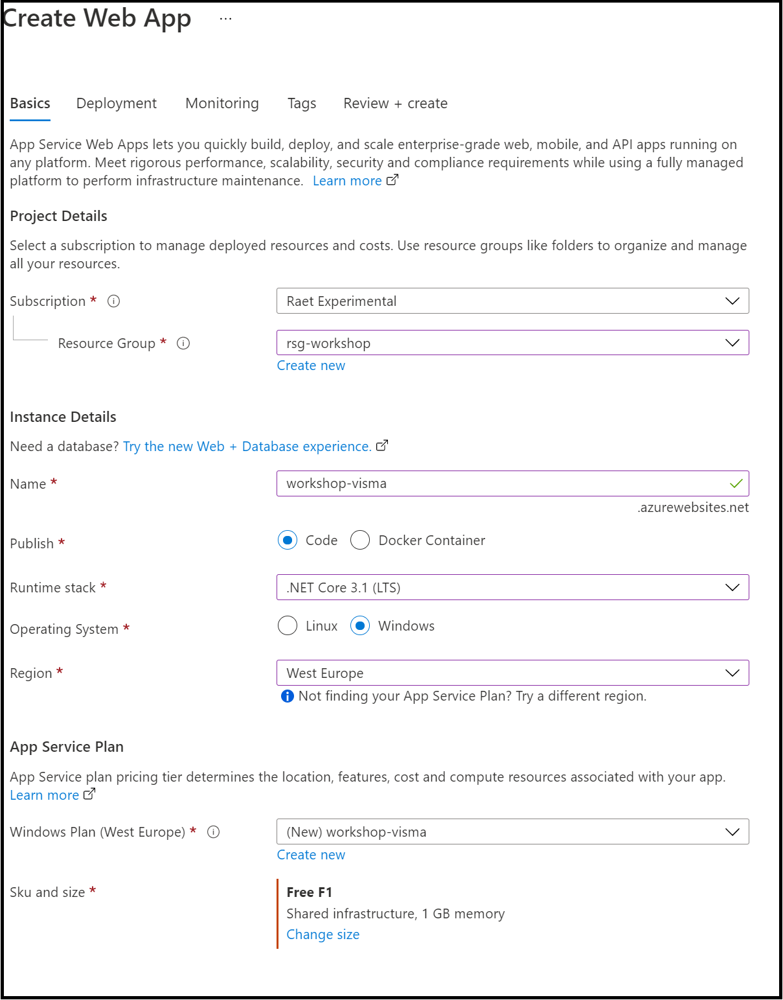
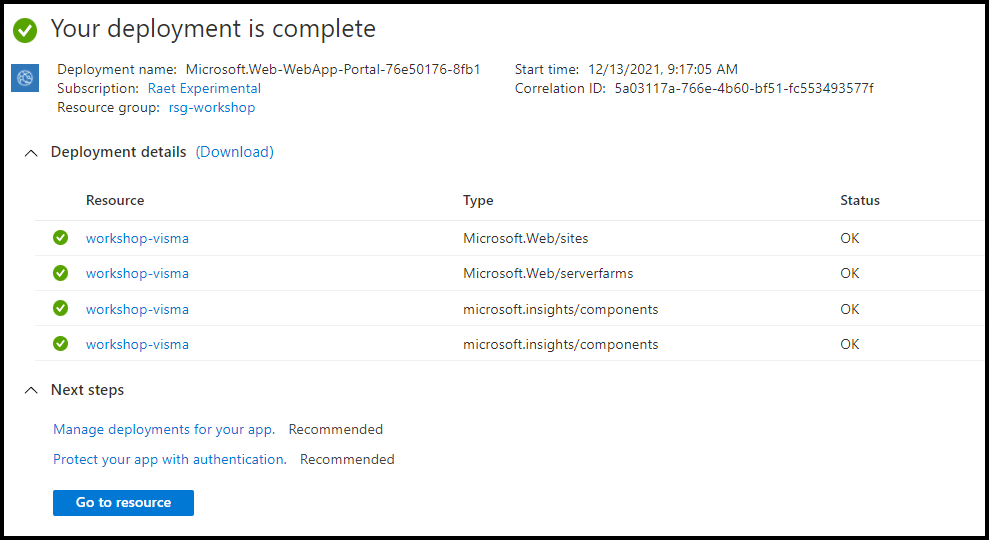

# VISMA Cloud Operations Workshop
To complete this workshop you need to follow next steps:
- Connect to github website
- Create new repository and copy current repository in your personal profile
- Create app service in Azure
- Link app service to this repository

## Prerequisites
- Have a github account
- Have git installed in your laptop \*
    - Install git on [MacOS](https://www.atlassian.com/git/tutorials/install-git#mac-os-x)
    - Install git on [Windows](https://www.atlassian.com/git/tutorials/install-git#windows)
    -  Install git on [Linux](https://www.atlassian.com/git/tutorials/install-git#linux)
- Add ssh key to github websit \*
    - Create new ssh key in your laptop
```
ssh-keyge -t rsa -b 4096 -C "your_email@example.com"
```

    - After ssh key is created you have a public/private key pair. You need to copy content of your-key.pub.

    - In github web page you need to go to uppper-right corner, click in your profile and then click Settings.

    - In the user settings sidebar, click SSH and GPG keys.

    - Click New SSH key.

    - In the "Title" field, add a descriptive label for the new key. Paste your key into the "Key" field.

    - Click Add ssh key.
    - You already have the ssh key. Now you need to go to Configure SSO.

    - Press "Autorize" botom to allow you work with visma-raet organization.


\* Only needed if you are going to use  terminal to work with github website.

## Connect to github website

Join to visma-raet organization pressing the button you have received through mail.

<p align="center">
    <image src="image/join-visma-raet.png"/>
</p>

Use you credentials to connect with the organization, in case you don't have it you need to create a new account in www.github.com page.


## Create new repository and copy current repository in your personal profile

To copy the repository from visma-raet organization you need to create a new repository in you personal profile. 
1. In the upper-right corner of any page, use the  drop-down menu, and select New repository.

<p align="center">
    <image src="image/new-repository.png"/>
</p>

2. In the Owner drop-down, select the account you wish to create the repository on.


3. Type a name for your repository, and an optional description.

>

4. Choose private in a repository visibility.


5. Continue with Website or Terminal section

### Website

6. At the bottom of the resulting Quick Setup page, under "Import code from an old repository", you have to choose import a project to your new repository and click Import code.


7. Click Create repository.


### Terminal

6. Click Create repository.

7. Open Git Bash.

8. Create a bare clone of the repository.

```
$ git clone --bare https://github.com/exampleuser/old-repository.git
```

9. Mirror-push to the new repository.
```
$ cd old-repository
$ git push --mirror https://github.com/exampleuser/new-repository.git
```
10. Remove the temporary local repository you created earlier.
```
$ cd ..
$ rm -rf old-repository
```


## Create app service in Azure via the Azure Portal

1. Login in Azure Portal
2. Create App Service and fill in all fields
    - **Subscription:** Raet Experimental
    - **Resource Group:** Create new resourge group
    - **Name:** Add a unique name
    - **Publish:** Code
    - **Runtime stack:** .NET Core 3.1(LTS)
    - **Operating System:** Windows
    - **Region:** West Europe
    - **App Service Plan**
        - **Windows Plan:** (Create new plan) Add new name
        - **Sku and size:** choose one cheep or free (Free F1 could be an option)



3. Wait until deployment is finish and presss boton "Go to resource"



4. You already have the app service created

## Create app service in Azure via Azure CLI

1. Open your PowerShell or Terminal application

2. Login to Azure

```az login```

3. Set the proper subscription to use

```az account set --subscription "Raet Experimental"```
or
```az account set --subscription e9a8847c-01a3-4abc-ad63-1411c13ab199```

4. Create a new resource group to place your resources in

```az group create --location westeurope --resource-group <name>```

5. Create an App Service Plan of the Free tier

```az appservice plan create --name <name> --resource-group <rsg name> --location westeurope --sku F1 --is-linux```

6. Create a WebApp part of the create App Service Plan

```az webapp create --name <name> --resource-group <rsg name> --plan <asp name>```

## Link app service to this repository


# SQLDeployment

Azure SQL Server and Azure SQL Database deployment using GitHub Actions.

It uses a YAML pipeline, which is in the /.github/workflows folder.

1. Define your susbscription and resource groups.
2. Deploy your credentials, you can do that by using this command:

Azure CLI Command (Replace server-name, subscription-id and resource-group)
   az ad sp create-for-rbac --name {server-name} --role contributor 
                            --scopes /subscriptions/{subscription-id}/resourceGroups/{resource-group} 
                            --sdk-auth

You will get a Json output similar to this one:

  {
    "clientId": "<GUID>",
    "clientSecret": "<GUID>",
    "subscriptionId": "<GUID>",
    "tenantId": "<GUID>",
    (...)
  }
  
3. Create your secrets in GitHub.

You must have tree secrets specified:

AZURE_SUBSCRIPTION, which contains the name of the susbcription where your resource group is located.
AZURE_RESOURCEGROUP, which contains the name of the resource group where you want to deploy your Azure SQL Server and database.
AZURE_CREDENTIALS, which contains the Json output with the role assignment credentials that provide access to your database.
  
4. Create the file that will deploy your SQL Server and SQL Database.
5. Create the workflow.

Documentation: https://docs.microsoft.com/en-us/azure/azure-sql/database/connect-github-actions-sql-db
               https://docs.microsoft.com/en-us/cli/azure/create-an-azure-service-principal-azure-cli
               https://www.kevinrchant.com/2020/11/23/deploying-to-azure-sql-database-using-github-actions
   