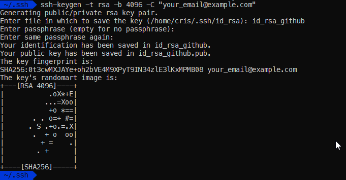
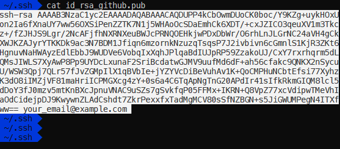
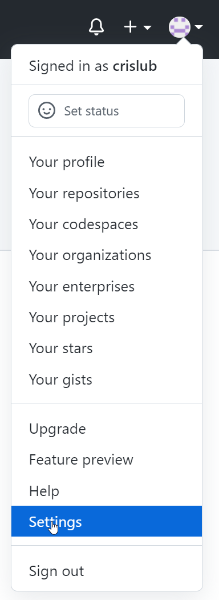
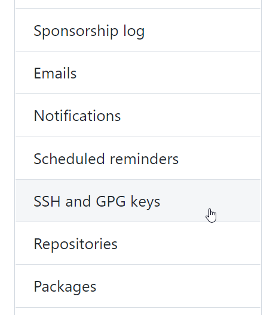
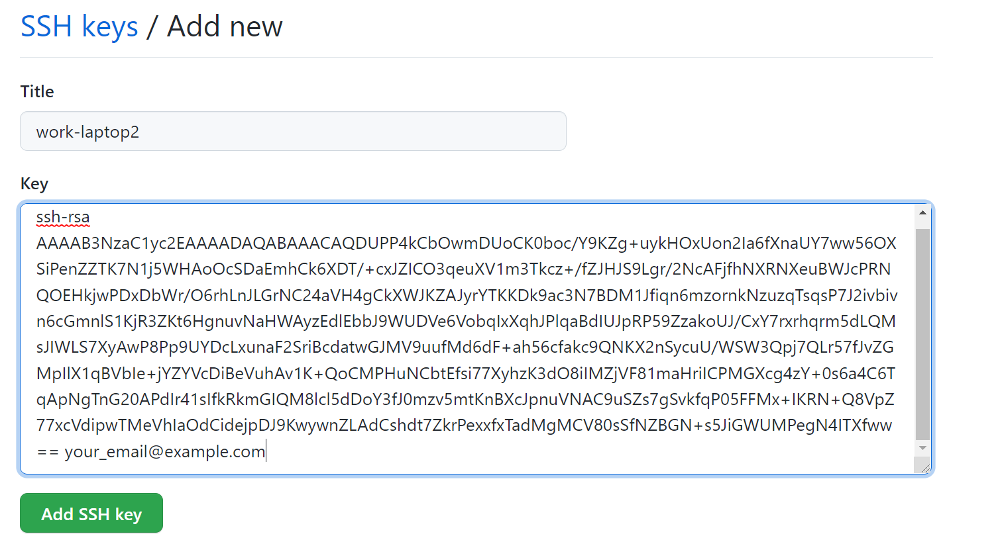
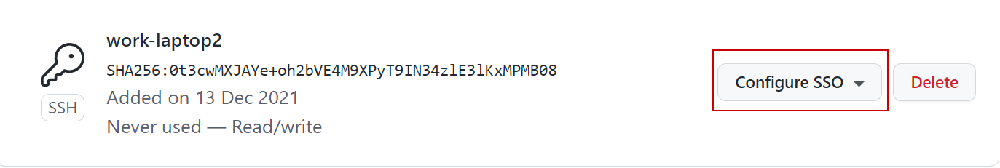
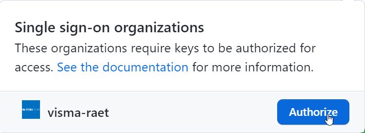

#Add ssh key

1. Create new ssh key in your laptop
```
ssh-keyge -t rsa -b 4096 -C "your_email@example.com"
```



2.  After ssh key is created you have a public/private key pair. You need to copy content of your-key.pub.



3. In github web page you need to go to uppper-right corner, click in your profile and then click Settings.



4. In the user settings sidebar, click SSH and GPG keys.



5. Click New SSH key.


 6. In the "Title" field, add a descriptive label for the new key. Paste your key into the "Key" field.



7. Click Add ssh key.
8. You already have the ssh key. Now you need to go to Configure SSO.



9. Press "Autorize" botom to allow you work with visma-raet organization.


